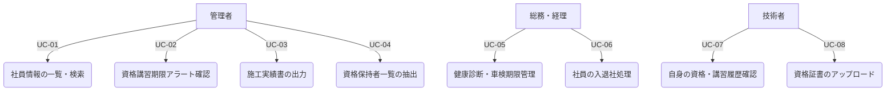
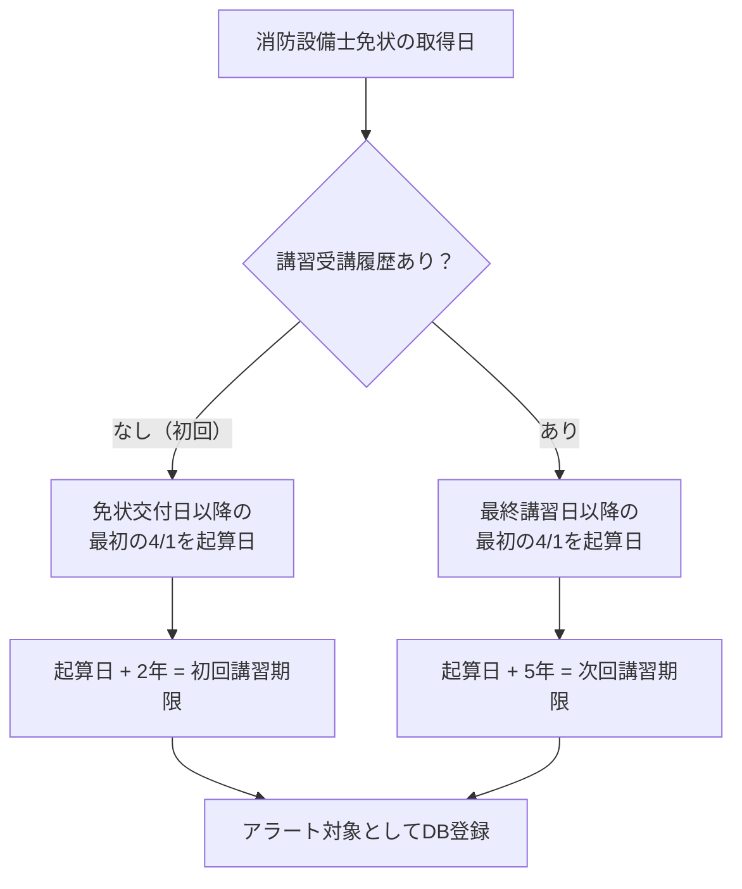
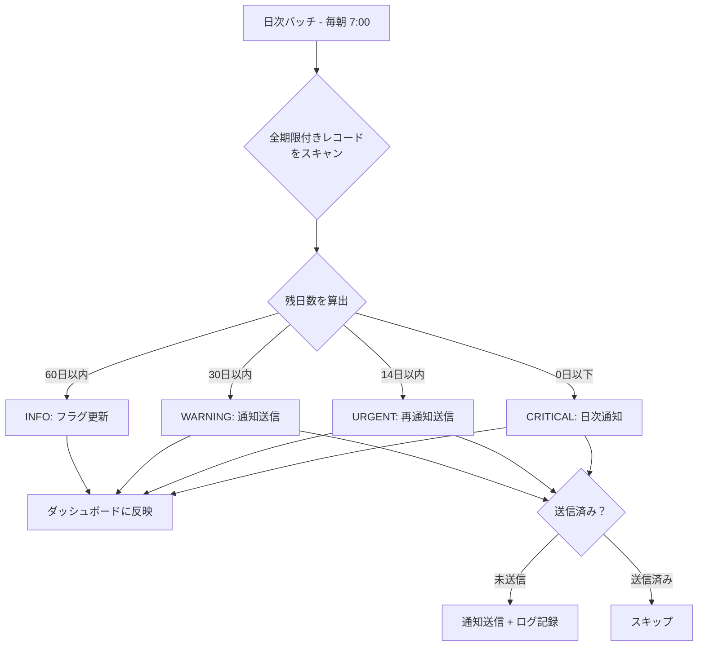
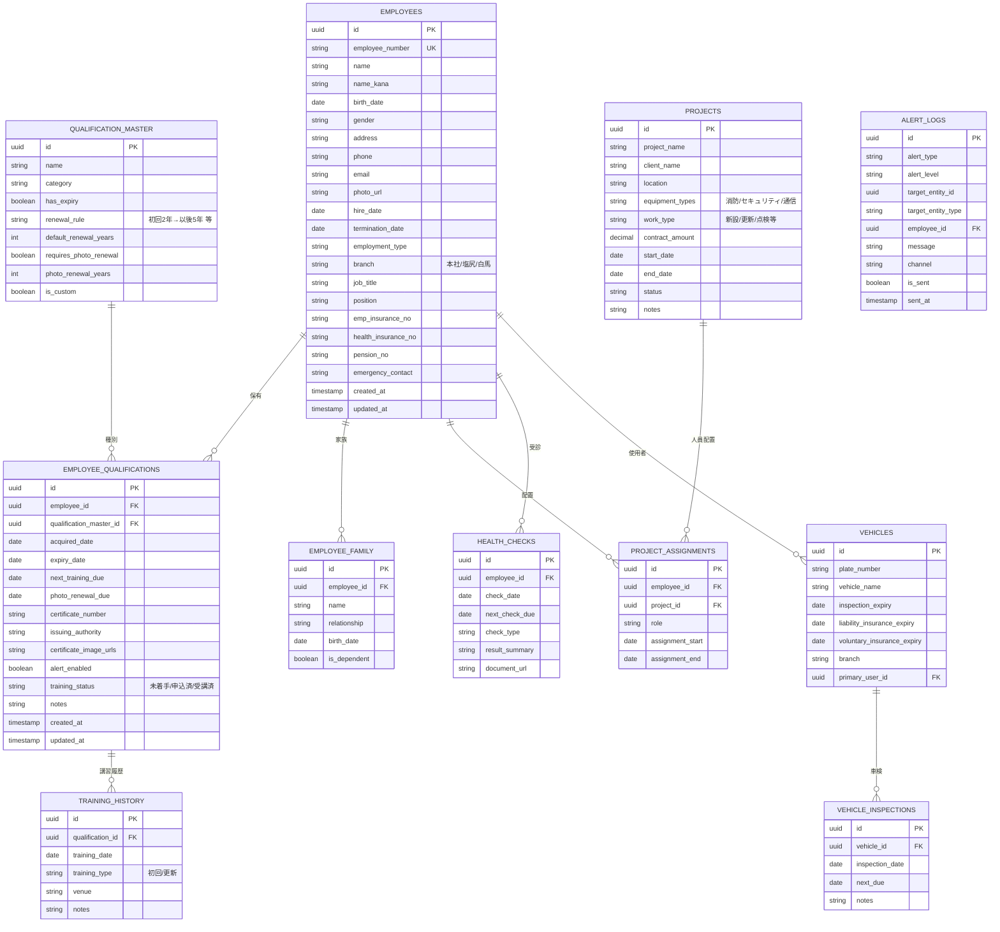
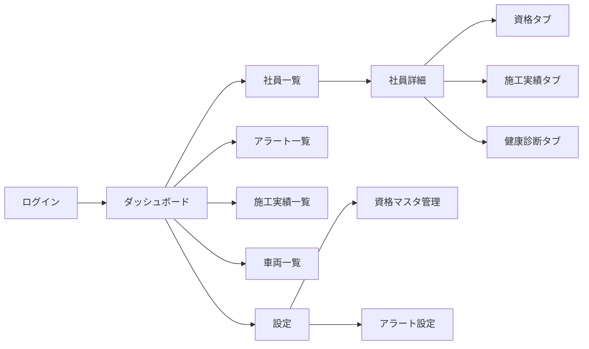
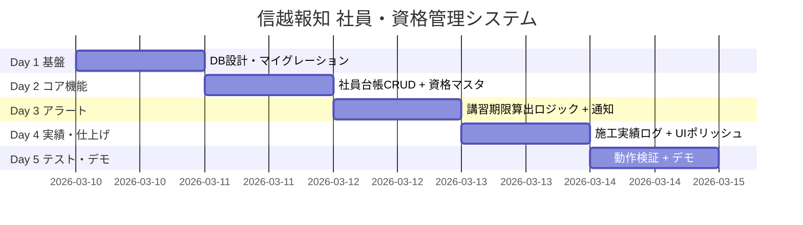

# 製品要求仕様書 (PRD) 詳細版
## 社員・資格管理システム（試作版）— 株式会社信越報知 向け

---

## 1. エグゼクティブサマリー

### 1.1 利用企業プロフィール

| 項目 | 内容 |
|---|---|
| **会社名** | 株式会社信越報知 |
| **設立** | 1972年（約50年以上の歴史） |
| **所在地** | 本社: 長野県松本市野溝西2-11-14 |
| | 塩尻営業所: 長野県塩尻市大字広丘原新田字中島215-16 |
| | 白馬営業所: 長野県北安曇郡白馬村北城3052-3 |
| **事業内容** | 消防設備・セキュリティ設備・通信設備の設計・施工・メンテナンス |
| **従業員規模** | 専門技術者 約20名（推定全体30〜50名規模） |
| **主要取引先** | 長野県庁、松本市役所、塩尻市役所、白馬村役所、各種学校、建設会社、電気工事店 |
| **Webサイト** | [shinetsu-hochi.jp](https://www.shinetsu-hochi.jp/) |

### 1.2 プロダクトビジョン

> **「管理に追われる時間を、現場に集中する時間へ」**

既存の高額タレントマネジメントシステム（カオナビ、タレントパレット等）に代わる、**消防設備業・中小企業の実務に特化した**社員情報管理ツール。消防設備士の講習期限管理など、業界特有の複雑な更新ルールに対応した「シンプル・低コスト・高機能アラート」を提供する。

### 1.3 成功指標（KPI）

| 指標 | 現状（推定） | 試作版目標 |
|---|---|---|
| 資格講習の受講漏れ | 年2〜3件リスクあり | **0件** |
| 社員情報の検索時間 | 5〜10分（Excel検索） | **10秒以内** |
| 施工実績書の作成時間 | 1件30分〜1時間 | **5分以内** |
| データ更新頻度 | 月1回程度 | **リアルタイム** |

---

## 2. ターゲットユーザーと利用シナリオ

### 2.1 ペルソナ定義

| ペルソナ | 役割 | 主な課題 | 利用頻度 |
|---|---|---|---|
| **A: 経営者・管理者** | iinuma氏、松岡氏 | 技術者の資格講習期限管理、現場配置判断 | 毎日 |
| **B: 総務・経理** | バックオフィス | 雇用保険、健康診断、車検、保険の期限管理 | 週3〜5回 |
| **C: 技術者 / 現場作業員** | 消防設備士等 | 自身の資格・講習履歴確認、証書アップロード | 月1〜2回 |

### 2.2 主要ユースケース



### 2.3 主要ユースケース詳細

#### UC-02: 資格講習期限アラートの確認
- **アクター**: 管理者、総務
- **基本フロー**:
  1. ダッシュボードに期限間近の講習・資格一覧が表示
  2. 「30日以内」「14日以内」「期限切れ」の3段階で色分け
  3. 該当社員の連絡先・資格詳細を確認
  4. 講習申込ステータスを記録
- **消防設備士特有のルール**:
  - 初回講習: 免状交付日以降の最初の4/1から**2年以内**
  - 2回目以降: 前回講習日以降の最初の4/1から**5年以内**
  - 免状写真更新: 交付後**10年以内**ごと

#### UC-03: 施工実績書の出力
- **アクター**: 管理者
- **基本フロー**:
  1. 対象社員を選択
  2. 出力対象期間を指定
  3. 施工実績（物件名、設備種別、施工内容、工期）をPDF/Excel出力

---

## 3. 機能要件の詳細

### P0: 最優先（試作版必須）

#### 3.1 社員台帳管理

| カテゴリ | 項目名 | データ型 | 必須 | 備考 |
|---|---|---|---|---|
| **基本情報** | 社員番号 | TEXT | ○ | 自動採番 or ユーザー定義 |
| | 氏名 | TEXT | ○ | |
| | 氏名（フリガナ） | TEXT | ○ | |
| | 生年月日 | DATE | ○ | |
| | 性別 | ENUM | ○ | |
| | 住所 | TEXT | ○ | |
| | 電話番号 | TEXT | ○ | |
| | メールアドレス | TEXT | | |
| | 顔写真 | FILE | | |
| **雇用情報** | 入社日 | DATE | ○ | |
| | 退社日 | DATE | | NULL=在籍中 |
| | 雇用形態 | ENUM | ○ | 正社員/契約/パート |
| | 所属 | ENUM | | 本社/塩尻営業所/白馬営業所 |
| | 職種 | TEXT | | |
| | 役職 | TEXT | | |
| **保険情報** | 雇用保険番号 | TEXT | | |
| | 健康保険番号 | TEXT | | |
| | 厚生年金番号 | TEXT | | |
| **緊急連絡先** | 氏名・続柄・電話番号 | TEXT | | |

---

#### 3.2 資格・免許マスタ

##### 社員資格データ項目

| 項目名 | データ型 | 必須 | 備考 |
|---|---|---|---|
| 資格マスタID | FK | ○ | 資格種別マスタへの参照 |
| 取得日 | DATE | ○ | |
| 有効期限 / 次回講習期限 | DATE | | NULL=期限なし |
| 証書番号 | TEXT | | |
| 証書画像 | FILE | | 複数枚対応 |
| 取得区分 | ENUM | | 試験/講習/実務経験 |
| 交付機関 | TEXT | | |
| 免状写真更新期限 | DATE | | 消防設備士用（10年ごと） |
| 講習申込ステータス | ENUM | | 未着手/申込済/受講済 |
| 備考 | TEXT | | |

##### 資格種別マスタ（信越報知向け初期データ）

> [!NOTE]
> 信越報知の事業（消防設備・セキュリティ・通信）に特化したプリセット。ユーザーがカスタム追加も可能。

| カテゴリ | 資格名 | 期限/講習 | 更新ルール |
|---|---|---|---|
| **消防設備士** | 甲種第1類（屋内消火栓・スプリンクラー等） | 講習義務あり | 初回2年→以後5年 |
| | 甲種第2類（泡消火設備等） | 〃 | 〃 |
| | 甲種第3類（不活性ガス消火設備等） | 〃 | 〃 |
| | 甲種第4類（自動火災報知設備等） | 〃 | 〃 |
| | 甲種第5類（避難はしご等） | 〃 | 〃 |
| | 甲種特類（特殊消防用設備等） | 〃 | 〃 |
| | 乙種第1類〜第7類 | 〃 | 〃 |
| | ※免状写真更新 | 10年ごと | |
| **消防設備点検** | 消防設備点検資格者 第1種 | 再講習あり | 5年ごと |
| | 消防設備点検資格者 第2種 | 〃 | 〃 |
| | 消防設備点検資格者 特種 | 〃 | 〃 |
| **電気工事** | 第一種電気工事士 | 定期講習あり | 5年ごと |
| | 第二種電気工事士 | なし | — |
| **通信** | 電気通信主任技術者 | なし | — |
| | 工事担任者（総合通信/第一級デジタル通信等） | なし | — |
| **安全衛生** | 酸素欠乏危険作業主任者 | なし | — |
| | 高所作業車運転技能講習 | なし | — |
| | 低圧電気取扱い特別教育 | なし | — |
| **運転免許** | 普通自動車免許 | あり | 3〜5年 |
| | 中型自動車免許 | あり | 3〜5年 |
| **防火管理** | 防火管理者（甲種/乙種） | 再講習あり | 5年ごと |
| | 防災管理者 | 再講習あり | 5年ごと |
| **その他** | 建設業許可（会社全体） | あり | 5年 |

---

#### 3.3 自動アラート通知

##### アラートルール

| レベル | トリガー | 通知方法 | 色 |
|---|---|---|---|
| **INFO** | 期限60日前 | ダッシュボードのみ | 🔵 青 |
| **WARNING** | 期限30日前 | ダッシュボード + **メール** | 🟡 黄 |
| **URGENT** | 期限14日前 | ダッシュボード + **メール**（再通知） | 🟠 橙 |
| **CRITICAL** | 期限切れ | ダッシュボード + **日次メール** | 🔴 赤 |

##### 消防設備士の講習期限算出ロジック



##### アラート配信フロー



##### 通知テンプレート例

```
件名: 【要対応】{社員名}の{資格名} 講習期限まで残り{残日数}日

{管理者名} 様

下記の講習・資格の期限が近づいています。

■ 社員名: {社員名}（{所属}）
■ 資格名: {資格名}
■ 講習期限: {期限日}（残り{残日数}日）
■ ステータス: {申込ステータス}
```

---

#### 3.4 施工実績ログ（現場経歴）

信越報知の実務に合わせ、消防設備の施工・点検実績を記録。

| 項目名 | データ型 | 必須 | 備考 |
|---|---|---|---|
| 工事ID | UUID | ○ | 自動採番 |
| 物件名 | TEXT | ○ | 例: ○○小学校、△△病院 |
| 発注者 | TEXT | ○ | 例: 松本市役所 |
| 物件所在地 | TEXT | ○ | |
| 設備種別 | ENUM[] | ○ | 消防/セキュリティ/通信/複合 |
| 施工内容 | ENUM | ○ | 新設/更新/増設/修繕/点検 |
| 契約金額（税抜） | DECIMAL | | |
| 着工日 | DATE | ○ | |
| 完工日 | DATE | | NULL=施工中 |
| 担当技術者の役割 | TEXT | | 現場責任者/作業員 等 |
| 備考 | TEXT | | |

---

#### 3.5 検索・フィルタ機能

| 検索タイプ | 例 |
|---|---|
| フリーワード | 「タナカ」→ 田中太郎 |
| 資格フィルタ | 「甲種4類」保持者一覧 |
| 期限順ソート | 講習期限が近い順 |
| 所属フィルタ | 本社/塩尻営業所/白馬営業所 |
| 複合検索 | 「甲種4類」かつ「本社所属」 |

---

### P1: 早期追加検討

#### 3.6 権限管理

| ロール | 社員基本情報 | 保険情報 | 資格情報 | 施工実績 | 設定 |
|---|---|---|---|---|---|
| **管理者** | CRUD | CRUD | CRUD | CRUD | CRUD |
| **総務** | CRU | CRUD | R | R | — |
| **技術者（本人）** | R（自分のみ） | — | R（自分のみ） | R（自分のみ） | — |

#### 3.7 モバイル最適化
- レスポンシブデザイン（現場からスマホで確認可能）
- 資格証書の写真アップロード（カメラ直接起動）

#### 3.8 車検・車両管理

| 項目名 | 備考 |
|---|---|
| 車両番号 | ナンバープレート |
| 車名・型式 | |
| 車検有効期限 | アラート対象 |
| 自賠責保険満期日 | アラート対象 |
| 任意保険満期日 | アラート対象 |
| 主な使用者 | FK → 社員 |
| 所属拠点 | 本社/塩尻/白馬 |

#### 3.9 点検スケジュール管理
- 顧客物件の消防設備点検スケジュール管理（年2回の義務点検）
- 点検担当の技術者アサイン

---

### P2: 将来検討

- **AI自動入力（OCR）**: 免状写真からの情報自動読み取り
- **LINE連携**: 「私の甲種4類の講習期限は？」→ 自動回答

---

## 4. データベース設計

### 4.1 ER図



### 4.2 主要インデックス

| テーブル | インデックス | 用途 |
|---|---|---|
| `employees` | `employee_number` (UNIQUE) | 社員番号検索 |
| `employees` | `branch` | 拠点フィルタ |
| `employee_qualifications` | `next_training_due` | 期限順ソート・アラート |
| `employee_qualifications` | `employee_id, qualification_master_id` | 重複チェック |
| `alert_logs` | `alert_level, is_sent` | アラート一括処理 |

---

## 5. 画面仕様

### 5.1 画面遷移図



### 5.2 ダッシュボード

```
┌──────────────────────────────────────────────────────┐
│  🔥 信越報知 社員・資格管理        [iinuma ▼]         │
├──────────────────────────────────────────────────────┤
│                                                      │
│  ┌────────┐ ┌────────┐ ┌────────┐ ┌────────┐        │
│  │👥 社員数 │ │🔴 期限切れ│ │🟡 30日以内│ │🟢 資格総数│  │
│  │  32名   │ │  1件    │ │  4件    │ │  85件   │       │
│  └────────┘ └────────┘ └────────┘ └────────┘        │
│                                                      │
│  ⚠️ 要対応アラート                                    │
│  ┌──────────────────────────────────────────────┐   │
│  │ 🔴 田中太郎(本社) 甲種4類講習 期限切れ5日        │   │
│  │ 🟠 鈴木一郎(塩尻) 第一種電気工事士講習 残14日    │   │
│  │ 🟡 佐藤花子(白馬) 普通免許更新 残28日            │   │
│  │ 🟡 山田次郎(本社) 甲種4類免状写真更新 残30日     │   │
│  └──────────────────────────────────────────────┘   │
│                                                      │
│  📅 今月の予定                                        │
│  ┌──────────────────────────────────────────────┐   │
│  │ 3/15 定期健康診断（本社）                        │   │
│  │ 3/20 社用車(松本300あ1234) 車検                  │   │
│  │ 3/25 ○○小学校 消防設備点検                      │   │
│  └──────────────────────────────────────────────┘   │
└──────────────────────────────────────────────────────┘
```

### 5.3 社員詳細画面

```
┌──────────────────────────────────────────────────────┐
│  ← 戻る   👤 田中 太郎（タナカ タロウ）  [編集] [削除]  │
├──────────────────────────────────────────────────────┤
│  [基本情報] [資格・免許] [施工実績] [健康診断] [書類]    │
├──────────────────────────────────────────────────────┤
│                                                      │
│  ┌──────┐  社員番号: SH-001                          │
│  │ 顔写真 │  入社日: 2015/04/01                       │
│  │      │  所属: 本社                                │
│  └──────┘  役職: 主任技術者                           │
│                                                      │
│  【保有資格サマリー】                                   │
│  ┌──────────────────────────────────────────────┐   │
│  │ 🔴 甲種第4類消防設備士  講習期限: 2026/03/04(切れ)│   │
│  │ 🟢 甲種第1類消防設備士  講習期限: 2027/04/01     │   │
│  │ 🟢 第一種電気工事士     講習期限: 2028/10/01     │   │
│  │ 🟡 免状写真更新        期限: 2026/06/15          │   │
│  └──────────────────────────────────────────────┘   │
│                                                      │
└──────────────────────────────────────────────────────┘
```

---

## 6. API設計

### 6.1 RESTful API エンドポイント

| メソッド | パス | 説明 |
|---|---|---|
| **社員** | | |
| GET | `/api/employees` | 一覧（フィルタ・ページネーション） |
| POST | `/api/employees` | 新規登録 |
| GET/PUT/DELETE | `/api/employees/:id` | 詳細/更新/削除 |
| **資格** | | |
| GET | `/api/employees/:id/qualifications` | 社員の資格一覧 |
| POST | `/api/employees/:id/qualifications` | 資格追加 |
| PUT/DELETE | `/api/qualifications/:id` | 更新/削除 |
| POST | `/api/qualifications/:id/upload` | 証書画像UP |
| POST | `/api/qualifications/:id/training` | 講習受講記録追加 |
| **資格マスタ** | | |
| GET/POST | `/api/qualification-master` | 一覧/カスタム追加 |
| **施工実績** | | |
| GET/POST | `/api/projects` | 一覧/登録 |
| GET/PUT | `/api/projects/:id` | 詳細/更新 |
| GET | `/api/employees/:id/assignments` | 社員の施工実績 |
| POST | `/api/assignments` | 配置登録 |
| **アラート** | | |
| GET | `/api/alerts` | 一覧 |
| GET | `/api/alerts/dashboard` | ダッシュボード用サマリー |
| PUT | `/api/alerts/:id/acknowledge` | 確認済み更新 |
| **車両** | | |
| GET/POST | `/api/vehicles` | 一覧/登録 |
| PUT | `/api/vehicles/:id` | 更新 |
| **エクスポート** | | |
| GET | `/api/employees/:id/career-export` | 施工実績書出力 |
| GET | `/api/employees/export` | 社員一覧CSV |
| GET | `/api/qualifications/expiring` | 期限間近の資格一覧 |

### 6.2 ダッシュボードAPIレスポンス例

```json
{
  "summary": {
    "total_employees": 32,
    "expired_count": 1,
    "within_30_days": 4,
    "total_qualifications": 85
  },
  "urgent_alerts": [
    {
      "level": "CRITICAL",
      "employee": { "name": "田中太郎", "branch": "本社" },
      "qualification": {
        "name": "甲種第4類消防設備士 講習",
        "expiry_date": "2026-03-04",
        "days_remaining": -5
      }
    }
  ]
}
```

---

## 7. 非機能要件

| 項目 | 要件 |
|---|---|
| **パフォーマンス** | ページ読込2秒以内、検索1秒以内 |
| **セキュリティ** | HTTPS必須、個人情報暗号化、Supabase RLS |
| **バックアップ** | 日次自動バックアップ（30日保持） |
| **ブラウザ** | Chrome/Safari/Edge 最新版、iOS/Android対応 |
| **同時接続** | 最大10名 |

---

## 8. 技術スタック（確定: フルコード型）

> [!NOTE]
> フルコード型での開発が確定しました。Excelデータは取り寄せ中のため、データ取得後にインポート機能を調整します。

| レイヤー | 技術 | 理由 |
|---|---|---|
| フロント | Next.js + TypeScript | 拡張性◎ |
| UI | shadcn/ui + Tailwind CSS | 高品質コンポーネント |
| DB | Supabase (PostgreSQL) | 無料枠あり、RLS対応 |
| ストレージ | Supabase Storage | 証書画像保存 |
| 認証 | Supabase Auth | メール認証 |
| 通知 | **Google Apps Script（メール）** | メール優先で確定 |
| ホスティング | Vercel | 無料枠で試作十分 |

---

## 9. 開発スケジュール（選択肢Aの場合）



---

## 10. リスクと対策

| リスク | 影響度 | 対策 |
|---|---|---|
| Excel/紙データの品質 | 高 | インポート時バリデーション + クリーニング |
| 技術者がデータ入力しない | 高 | モバイル対応 + 最小入力 + 管理者代行 |
| 消防設備士の講習期限計算の複雑さ | 中 | 4/1起算ルールを確実にテスト |
| 個人情報の漏洩 | 高 | RLS + HTTPS + 暗号化 + アクセスログ |

---

## 11. 確認事項

> [!WARNING]
> 以下についてiinuma氏・松岡氏への確認が必要です。

| # | 項目 | ステータス |
|---|---|---|
| 1 | 技術スタック | ✅ **フルコード型（Next.js + Supabase）に確定** |
| 2 | 通知チャネル | ✅ **メール優先に確定** |
| 3 | 既存データ（Excel） | 🔄 **取り寄せ中** — 取得後にDB設計を微調整 |
| 4 | 権限管理 | ❓ 試作段階では管理者のみで十分か |
| 5 | 点検スケジュール管理（P1.9） | ❓ 顧客物件の点検管理も含めるか |
| 6 | 拠点ごとの管理 | ❓ 3拠点で別々に管理が必要か |
