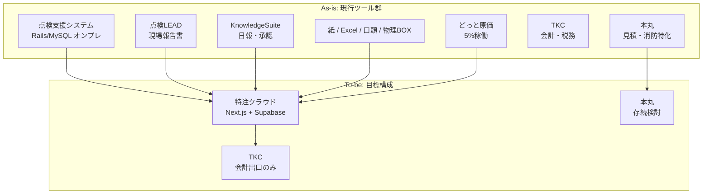
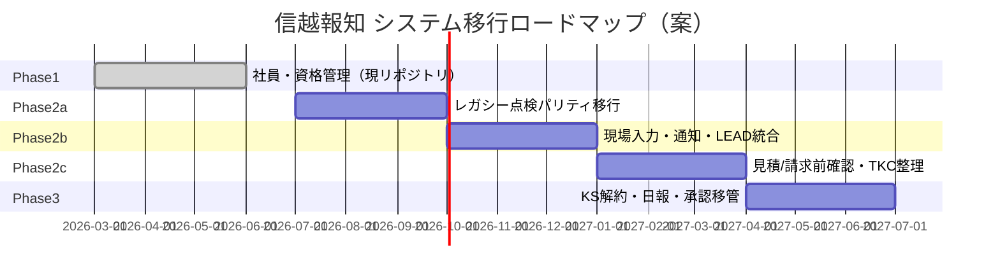

# As-is / To-be 業務フロー分析（改訂版）

| 項目 | 内容 |
|------|------|
| **作成日** | 2026年8月6日 |
| **共有用（Google ドキュメント）** | [As-is To-be 業務フロー分析（信越報知）](https://docs.google.com/document/d/1q4HFXxAXiDobZ0Q6xL__kzaaMMpJlEV-XZgkHMUO-dk/edit) |
| **根拠資料** | Google Drive「[信越報知システム](https://docs.google.com/spreadsheets/d/1aG8tynPp77lnSs3tg4ZapRgId_2hA3eax4N5AIiHvHo/edit)」スプレッドシート |
| **レガシー調査** | [legacy-inspection-system-report.md](./legacy-inspection-system-report.md) |
| **リプレイスPRD** | [inspection-system-prd.md](./inspection-system-prd.md) |
| **Phase 1 PRD** | [detailed_prd.md](../detailed_prd.md) |

---

## 1. エコシステム全体像

信越報知のメンテナンス業務は、**単一システムではなく複数ツール＋紙・口頭**で回っている。スプレッドシート上の「点検支援システム」は、配布された Rails オンプレアプリ（`legacy-src/shinetsuhochi/`）を指す。



**To-be の北極星**（スプレッドシートより）:

> 紙・口頭・帰社後入力と使い切れていない SaaS を減らし、**点検・補修・日報・承認・請求前確認**を1つの特注ツールに集約。**TKC だけ**を会計・税務の出口として残す。

---

## 2. 「点検支援システム」の正体と As-is での役割

### 2.1 スプレッドシート上の定義

| 記載 | 意味 |
|------|------|
| 「メンテは日報として使っていない。**メンテは支援システムが日報代わり**」 | メンテ部の作業記録＝支援システムへの実績入力 |
| 「**支援システムで報告**、本丸で見積書の確認。修繕の履歴が残る」 | 補修ステータス・履歴は支援システム、見積書本体は本丸 |
| 「点検LEADはその場で外で出来る。**支援システムの方はできない**」 | **二重入力**の根本原因 |
| 「帰社後、オンプレ既存システムへ入力」 | モバイル非対応・VPN/社内ネット前提 |

### 2.2 レガシーコードがカバーする範囲（コード調査結果）

| スプレッドシート工程 | 支援システムの機能 | コントローラ / テーブル |
|---------------------|-------------------|------------------------|
| 案件登録 | ◎ 発注者・物件・点検契約登録 | `buken_toroku`, `m_orderingpatries`, `m_housinginfos`, `t_check_infos` |
| 点検予定管理 | ◎ 年度別予定・担当者・予定月 | `yotei_admin`, `t_chktrackrec_infos.tenkenyoteiM` |
| 点検準備 | △ PC一覧・帳票のみ。モバイルなし | `yotei_admin` / `yotei`（担当者版） |
| 現場点検 | × システム外（紙・LEAD） | — |
| 帰社後点検結果入力 | ◎ 実績登録・ST更新 | `jiseki_toroku`, `t_chktrackrec_infos` |
| 不備あり判定 | △ 補修有無(hoshuumu)・補修ST | `jiseki_toroku`, `t_repair_infos` |
| 不備共有 | △ 営業向け自動通知なし。一覧で確認 | `yotei_admin` 上の補修ST |
| 見積依頼〜 | × 本丸 / Excel / 口頭 | — |
| 補修管理 | ◎ ST・履歴・完了日 | `t_repair_infos`, `hoshurireki` |
| 帳票 | ◎ PDF 8種 | ThinReports `.tlf` |
| 次年度更新 | ◎ バッチ | `admin_menu` |
| 請求〜 | × TKC / 紙BOX | — |
| 日報 | △ メンテは実績入力が日報代わり | 専用日報機能なし |
| 承認 | × KnowledgeSuite | — |

**凡例**: ◎=主ツール △=一部 ×=対象外

---

## 3. As-is フロー分析（25工程）

スプレッドシート「業務フロー」シートに、レガシー実装との対応を追記した整理。

| No | 工程 | 主担当 | As-is ツール | 支援システムの関与 | 主な課題（シート記載） |
|----|------|--------|-------------|-------------------|----------------------|
| 1 | 案件登録 | 営業 | 支援システム/Excel/口頭 | **◎** 物件・発注者・契約登録 | 後続工程への共有が見えにくい |
| 2 | 点検予定管理 | 営業/メンテ | 支援システム/紙/KS承認 | **◎** 予定月・担当・一覧 | 予定変更のリアルタイム共有弱い、官庁案件の金額変動 |
| 3 | 点検準備 | メンテ | 紙/支援システム/案件情報シート | **△** PCで一覧参照のみ | 現場で必要情報が不十分、外でも見たい |
| 4 | 現場点検 | メンテ | 紙/LEAD/支援システム | **×** 現場入力不可 | LEADと支援システムの**二重入力** |
| 5 | 帰社後点検結果入力 | メンテ | **支援システム** | **◎** 実績登録の主战场 | 記憶頼り・漏れ・残業・後続遅延 |
| 6 | 不備あり判定 | メンテ/営業 | 支援システム/口頭 | **△** hoshuumu・補修ST | 営業・経理へ即共有されない |
| 7 | 不備共有 | メンテ→営業 | 口頭/紙/BOX | **△** 見積依頼を営業が一覧確認 | 口頭依存・属人化 |
| 8 | 見積依頼 | 営業 | 口頭/紙/Excel | × | 一覧性弱い |
| 9 | 見積作成 | 営業 | **本丸**/Excel | × | 案件と見積の紐づき弱い |
| 10 | 見積確認・承認 | 営業/メンテ | 紙/口頭/本丸 | × | 承認ルール不明確 |
| 11 | 見積提出 | 営業 | メール/本丸 | × | 提出日・期限が属人管理 |
| 12 | 顧客回答待ち | 営業 | 個別管理 | × | 督促対象が見えない |
| 13 | 受注・補修依頼 | 営業→メン�te | 口頭/紙/BOX | △ 補修STで間接把握 | 指示者・記録先が不明 |
| 14 | 補修予定調整 | メンテ | 紙/ホワイトボード | × | 予定変更が見えない |
| 15 | 補修実施 | メンテ | 現場/紙 | × | 完了判断・共有が不明 |
| 16 | 修繕報告書作成 | メンテ | 紙/既存帳票 | △ 履歴は支援システム | 紙の回覧・待ち |
| 17 | 社内確認BOX提出 | メンテ | **物理BOX** | × | 紛失・遅延リスク |
| 18 | 原価入力 | メンテ/営業 | どっと原価/Excel | △ 外注費は契約/実績に | 見積・進捗・原価が分断 |
| 19 | 営業確認 | 営業 | 紙/BOX | × | 確認タイミング属人 |
| 20 | 請求確認済み | 営業 | 紙/口頭 | △ 点検ST「請求済み」相当 | 請求OK条件が未明文化 |
| 21 | 経理確認 | 経理 | 紙/BOX | × | 後追い・漏れ |
| 22 | 請求処理 | 経理 | **TKC** | × | 案件とTKC分断 |
| 23 | 請求完了 | 全員 | TKC/Excel | × | 完了が全員に見えない |
| 24 | 日報 | 工事部 | **KnowledgeSuite** | △ メンテは支援システムが代替 | KS過剰・案件紐づき弱 |
| 25 | 稟議・承認 | 全員 | **KnowledgeSuite** | × | 承認が分散 |

### As-is の構造問題（3点）

1. **二重入力**: 点検LEAD（現場・報告書）＋ 支援システム（帰社後・契約/実績/補修ST）
2. **断絶**: 支援システム（点検〜補修ST）→ 本丸（見積）→ 紙BOX → TKC の間にデータ連携なし
3. **モバイル空白**: スプレッドシートが最重要課題とする「現場入力」は支援システムの外（LEADのみ部分対応）

---

## 4. To-be フロー分析（28工程）

To-be は「特注クラウド1本」への集約。各工程について **レガシー継承 / 新規開発 / 外部残存** を分類。

| No | To-be 工程 | 新システムでやること | レガシー継承 | 新規（レガシーに無い） | 外部に残す |
|----|-----------|---------------------|:------------:|:---------------------:|-----------|
| 1 | 案件登録 | 案件ID・顧客・物件・進捗一元 | ◎ | 案件ID概念の明示化 | — |
| 2 | 点検予定管理 | 予定・担当・期限 | ◎ | リアルタイム通知 | — |
| 3 | 現場で点検情報確認 | スマホで物件・内容確認 | △一覧 | **◎ モバイルUI** | — |
| 4 | 現場で点検実施 | 進捗を案件に紐付け | × | **◎** | — |
| 5 | **現場で点検結果登録** | 結果・不備・写真を現場登録 | △実績登録 | **◎ モバイル・写真・LEAD統合** | — |
| 6 | 不備あり判定 | 不備あり/なし ST | ◎ | — | — |
| 7 | **不備あり通知** | 営業へ自動通知 | × | **◎ 通知** | — |
| 8 | 見積依頼化 | 見積依頼中 ST | × | **◎ ワークフロー** | — |
| 9 | 見積作成 | 案件紐づけ見積 | × | ◎ or 連携 | **本丸（存続案）** |
| 10 | 見積承認 | 承認フロー | × | **◎** | — |
| 11 | 見積提出 | 提出済・回答待ち | × | **◎** | — |
| 12 | 顧客回答管理 | 受注/失注/保留 | × | **◎** | — |
| 13 | 補修依頼 | 補修対象・希望日 | △補修ST | **◎ 依頼レコード** | — |
| 14 | 補修予定管理 | 担当・日程 | × | **◎** | — |
| 15 | 現場で補修実施 | 補修中 ST | △ | ◎ | — |
| 16 | **現場で補修結果登録** | 結果・写真 | △ | **◎ モバイル** | — |
| 17 | 報告書作成・添付 | 案件に紐づけ保存 | △帳票PDF | **◎ 添付・電子化** | — |
| 18 | 原価入力 | 材料・外注・労務 | △外注費 | **◎ 案件原価** | どっと原価（要確認） |
| 19 | 案件収支確認 | 粗利可視化 | × | **◎** | — |
| 20 | 請求前確認 | 見積・補修・報告書・原価を一覧 | × | **◎** | — |
| 21 | 請求OK登録 | 請求可能 ST | △点検ST | **◎ 請求ワークフロー** | — |
| 22 | 経理確認 | 書類不足・差戻し | × | **◎** | — |
| 23 | TKC入力 | 確定情報をもとに入力 | × | △ CSV/export | **TKC** |
| 24 | 請求完了登録 | 請求完了 ST | × | **◎** | — |
| 25 | 案件完了 | 完了 ST | × | **◎** | — |
| 26 | 日報管理 | 案件紐づけ日報 | △実績=日報代わり | **◎ KS代替** | — |
| 27-28 | 稟議・承認 | 必要承認のみ | × | **◎ KS代替** | — |

---

## 5. ギャップ分析：支援システム vs To-be vs 現リポジトリ

### 5.1 三層マップ

```
┌─────────────────────────────────────────────────────────────┐
│  To-be（スプレッドシート）                                    │
│  点検現場入力〜請求OK〜日報〜承認 の End-to-End              │
└───────────────────────────┬─────────────────────────────────┘
                            │ ギャップ（新規開発）
┌───────────────────────────▼─────────────────────────────────┐
│  点検支援システム（レガシー Rails）                            │
│  物件契約・予定/実績・補修ST・帳票8種・次年度更新              │
└───────────────────────────┬─────────────────────────────────┘
                            │ Phase 2a = 機能パリティ移行
┌───────────────────────────▼─────────────────────────────────┐
│  Phase 1（本リポジトリ Next.js）                              │
│  社員・資格・施工実績・アルコール等 ※点検業務は未実装         │
└─────────────────────────────────────────────────────────────┘
```

### 5.2 機能ギャップ一覧

| 領域 | 支援システム（As-is） | To-be 要求 | Phase 2 PRD | 優先 |
|------|----------------------|-----------|-------------|------|
| 物件・契約マスタ | ◎ | ◎ | P2a | 高 |
| 点検予定/実績一覧 | ◎ | ◎ + モバイル | P2a | 高 |
| 帰社後実績入力 | ◎ | **現場入力に置換** | P2a→P2b | 最高 |
| 点検LEAD相当 | ×（別ツール） | 統合 or 連携 | **未PRD化** | 最高 |
| 不備→営業通知 | × | ◎ | **未PRD化** | 高 |
| 見積ワークフロー | ×（本丸） | ◎ or 本丸連携 | 確認待ち #5 | 高 |
| 補修予定・現場登録 | △ STのみ | ◎ | P2b | 高 |
| 請求前確認〜請求OK | × | ◎ | **未PRD化** | 高 |
| TKC連携 | × | CSV/手入力整理 | P2b | 中 |
| 日報（メンテ） | △ 実績=日報 | 案件紐づけ日報 | **未PRD化** | 中 |
| 承認 | ×（KS） | 最小限承認 | **未PRD化** | 中 |
| 社員・資格 | × | Phase 1 で実装中 | **Phase 1** | — |

### 5.3 スプレッドシート「何が楽になるか」と実装マップ

| 改善テーマ | To-be | レガシーで既にある | 新規に必要 |
|-----------|-------|-------------------|-----------|
| 現場入力 | スマホで結果・不備・写真 | × | **核心ギャップ** |
| 不備共有 | 登録と同時に営業通知 | △ 一覧のみ | 通知機能 |
| 見積管理 | 見積依頼 ST 一覧 | × | ワークフロー or 本丸API |
| 補修管理 | 案件単位で予定・完了 | ◎ ST/履歴 | 予定・現場登録 |
| 報告書管理 | 案件に紐づけ | △ PDF生成 | 添付・電子保管 |
| 請求漏れ防止 | 請求可能一覧 | × | 請求前確認モジュール |
| TKC前整理 | 請求前情報確定 | × | export + ST |
| 日報 | KS解約・最小限 | △ | 工事部向け日報 |
| 稟議・承認 | KS解約・最小限 | × | 固定ルート承認 |
| SaaS整理 | 特注1本 + TKC | — | 全体アーキテクチャ |

---

## 6. 推奨ロードマップ（As-is → To-be）



| フェーズ | 目的 | スプレッドシート To-be 達成度 |
|--------|------|------------------------------|
| **Phase 1**（実装中） | 社員・資格・施工実績 | 点検フローとは独立。担当者マスタの土台 |
| **Phase 2a** | 支援システムクラウド移行 | No.1-2, 5-6, 補修履歴 ≒ **40%** |
| **Phase 2b** | **現場入力・LEAD統合** | No.3-5, 16 ≒ **+25% → 65%** |
| **Phase 2c** | 見積〜請求OK | No.8-22 ≒ **+25% → 90%** |
| **Phase 3** | KS解約・日報・承認 | No.24-28 ≒ **残10%** |

---

## 7. 外部ツール To-be 方針

| ツール | As-is | スプレッドシート To-be | 推奨 |
|--------|-------|----------------------|------|
| **点検支援システム** | オンプレ・帰社後入力 | **特注クラウドに完全移行** | Phase 2a で置換 |
| **点検LEAD** | 現場報告書 | 新システムに統合 or API連携 | Phase 2b で判断（確認#19） |
| **本丸** | 見積フル活用 | 存続 or 見積のみ連携 | 確認#5（高優先） |
| **KnowledgeSuite** | 日報・承認 | **解約**、必要機能のみ移管 | Phase 3 |
| **どっと原価** | 5%稼働 | 必要最小限を移管 | 確認#10 |
| **TKC** | 会計出口 | **残す** | CSV/export で連携 |

---

## 8. 確認事項（スプレッドシート18項）× 分析所見

| No | テーマ | 分析上の示唆 |
|----|--------|-------------|
| 1 | 現場入力 | **To-be の最重要**。レガシーはここが空白。オフライン要否で設計が変わる |
| 2 | 点検項目 | LEADに項目あり → 統合なら LEAD 側仕様を取り込む |
| 3-4 | 不備判定・通知 | レガシー `hoshuumu` を拡張 + 通知が To-be の核心 |
| 5 | 本丸 | **本丸残存**なら見積は連携のみ。新規開発量が大きく変わる |
| 7-8 | 補修指示・完了 | レガシー補修ST(6段)をベースに、予定・現場登録を追加 |
| 9 | 報告書 | レガシー8帳票 + LEAD報告書。初期は**添付中心**が現実的 |
| 11-13 | 請求OK・TKC | レガシーに無い。**Phase 2c** の主題 |
| 15 | 既存ツール整理 | 本分析 §7 が整理案 |
| 16-17 | KS日報・承認 | メンテ=支援システム、工事=KS → **部門で移行対象が異なる** |
| 18 | 点検支援システム | **案件登録〜案件票管理まで同一システム** → コード上は ◎（帳票含む） |
| 19 | 点検LEAD | 報告書以外の利用有無で統合範囲が決まる |

---

## 9. 結論

### As-is の実態

「点検支援システム」は **メンテナンス部の契約・予定・実績・補修ステータス管理の中核**だが、

- **現場入力は点検LEAD**、**帰社後に支援システム**という二重構造
- **見積は本丸**、**請求は紙BOX→TKC** と工程が分断
- **日報・承認は KnowledgeSuite**（メンテは支援システムが日報代わり）

### To-be との距離

| 区分 | 内容 |
|------|------|
| **レガシーで足りる部分** | 物件/契約/予定/実績/補修ST/帳票/次年度更新（≈40%） |
| **レガシーを拡張すれば足りる部分** | モバイルUI、写真添付、通知、補修予定（≈25%） |
| **新規モジュール** | 見積WF、請求前確認、請求OK、TKC export、日報、承認（≈35%） |

### 現リポジトリ（Phase 1）との関係

Phase 1 は **点検業務フローの外側**（人・資格）を担う。To-be を実現するには **Phase 2 以降で支援システムをリプレイスし、Phase 1 の `employees` と統合**する必要がある。

---

## 10. 関連ドキュメント更新提案

本分析を反映し、以下を次版で拡張することを推奨:

1. **[inspection-system-prd.md](./inspection-system-prd.md)** — Phase 2b/2c に現場入力・通知・請求WF を追記
2. **[detailed_prd.md](../detailed_prd.md)** — §13 に本 As-is/To-be へのリンク
3. **Google Drive「信越報知システム」** — No.18 確認事項「同一システム」→ **コード上は Yes（帳票・実績まで含む）** と回答可能

---

*出典: [信越報知システム スプレッドシート](https://docs.google.com/spreadsheets/d/1aG8tynPp77lnSs3tg4ZapRgId_2hA3eax4N5AIiHvHo/edit)（2026-08-06 時点）*
