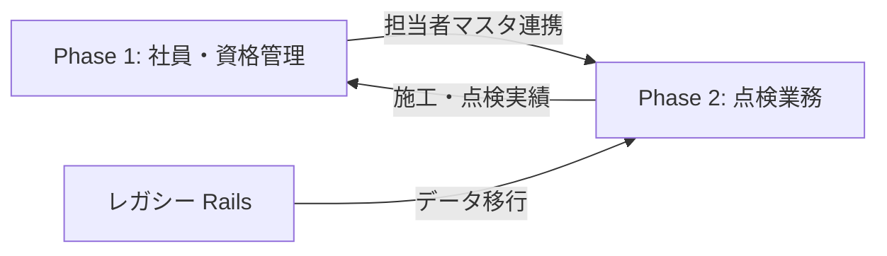
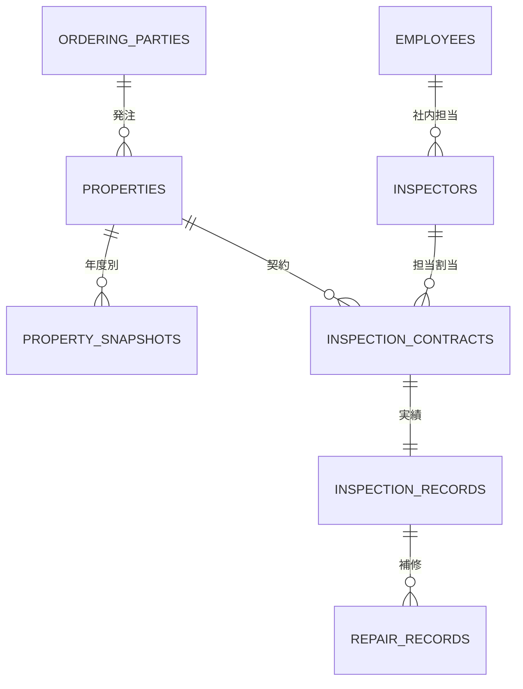

# Phase 2 PRD: 保守点検業務支援システム リプレイス

| 項目 | 内容 |
|------|------|
| **文書種別** | 製品要求仕様書（Phase 2 追補） |
| **親文書** | [detailed_prd.md](../detailed_prd.md) |
| **調査根拠** | [legacy-inspection-system-report.md](./legacy-inspection-system-report.md) |
| **作成日** | 2026年8月6日 |
| **対象** | 株式会社信越報知 — 消防設備点検・補修業務 |

---

## 1. 背景と目的

### 1.1 現状（レガシーシステム）

2014年頃に開発された Rails 4.1 + MySQL の「保守点検業務支援システム」が本番運用されている。

| 項目 | 内容 |
|------|------|
| 技術 | Rails 4.1.4 / MySQL / ThinReports / jQuery |
| データ規模 | 物件1,855 / 点検契約12,409 / 点検実績12,407 / 補修4,270 |
| 年度 | 5月開始（例: 2026/05/01〜2027/04/30） |
| 認証 | 4桁数字ID + パスワード（平文相当） |

**課題**

- 技術スタック老朽化（Ruby 2.x / Rails 4.x、現行環境で起動困難）
- Phase 1（社員・資格管理）とのデータ分断（担当者・物件が二重管理）
- セキュリティ（平文PW、CSRFのみ、RLSなし）
- PDF帳票が ThinReports 依存

### 1.2 リプレイス目的

> **「点検契約から実績・補修・帳票までを、Phase 1 と一体の Next.js + Supabase 基盤で再構築する」**

| 目標 | レガシー基準 | リプレイス目標 |
|------|-------------|----------------|
| 機能パリティ | 33画面・8帳票 | **100% 機能同等**（UIは現行デザインシステムに準拠） |
| 点検予定の検索 | 管理者8条件検索 | 同等 + レスポンシブ |
| 次年度更新 | 手動バッチ | 同等（確認ダイアログ + 監査ログ） |
| 認証 | 4桁数字 | Supabase Auth（メール or 社員番号連携） |
| データ移行 | — | レガシー MySQL → PostgreSQL 一括移行 |

### 1.3 Phase 1 との関係

- **共有**: `employees`（社内点検担当者）← レガシー `m_checkpeople` + `m_pwd`
- **新規**: 発注者・物件・点検契約・実績・補修（レガシー `m_*` / `t_*` 相当）
- **統合**: ダッシュボードに「今月の点検予定」「未完了件数」を Phase 1 と同一UIで表示（P2後半）

---

## 2. 利用者とロール

| ロール | レガシー相当 | 人数想定 | 主な操作 |
|--------|-------------|----------|----------|
| **点検管理者** | 管理者 (`urole=0`) | 2〜3名 | 物件CRUD、予定/実績一覧、次年度更新、帳票、初期設定 |
| **点検担当者** | 点検担当 (`urole=1`) | 〜20名 | 自分担当分の予定確認、実績登録 |
| **システム管理者** | システム (`urole=2`) | 1名 | バックアップ/リストア（Phase 2後半 or Supabase標準機能へ移行） |

### 2.1 権限マトリクス【REQ-INS-001】

| 機能 | 点検管理者 | 点検担当者 | システム管理者 |
|------|:----------:|:----------:|:--------------:|
| 点検予定/実績一覧（全件） | ● | × | × |
| 点検予定/実績一覧（自分担当） | ● | ● | × |
| ステータス一括変更 | ● | × | × |
| 実績登録・補修 | ● | ● | × |
| 物件登録・変更・停止・削除 | ● | × | × |
| 点検担当者マスタ CRUD | ● | × | × |
| 発注者検索 | ● | × | × |
| 帳票出力（8種） | ● | ●※ | × |
| 初期設定（ST名称・年度） | ● | × | × |
| 次年度データ作成 | ● | × | × |
| DBリストア | × | × | ● |

※ 担当者版は検索結果ベースの帳票のみ。

---

## 3. 機能要件

### 3.1 マスタ管理

#### 3.1.1 発注者【REQ-INS-010】

| 要件ID | 要件内容 |
|--------|----------|
| REQ-INS-010-01 | 発注者名・担当者・郵便番号・住所・TEL・FAX を登録・更新できる |
| REQ-INS-010-02 | 発注者検索（部分一致）で既存発注者を選択できる |
| REQ-INS-010-03 | 同名発注者の新規登録時はエラーとする（レガシー MESSAGE_22 同等） |
| REQ-INS-010-04 | 物件に紐づく発注者変更時、他物件が無ければ旧発注者Mを削除できる |

#### 3.1.2 物件【REQ-INS-011】

| 要件ID | 要件内容 |
|--------|----------|
| REQ-INS-011-01 | 物件名・担当者・住所・TEL・FAX・メモ1/2 を管理する |
| REQ-INS-011-02 | 点検開始年度・点検区分（毎年/2年/3年/スポット）・請求方法を必須とする |
| REQ-INS-011-03 | 点検種別を1件以上選択し、種別ごとに契約行（予定月・金額・担当者）を生成する |
| REQ-INS-011-04 | 消防設備(総合)2回選択時、種別11+12の2行を自動生成する |
| REQ-INS-011-05 | 消防設備は担当者最大10名・外注費10枠。他種別は3名 |
| REQ-INS-011-06 | メイン点検担当者を各契約行で1名指定する |
| REQ-INS-011-07 | 停止物件（teishiFlg=1）のみ「再利用」で再登録できる |
| REQ-INS-011-08 | 物件削除時、MD5相当の確認トークンで改ざんを防ぐ |

**点検種別マスタ（初期データ）**

| コード | 名称 | 回数 |
|--------|------|------|
| 11 | 消防設備(総合) | 1 or 2（2回目→12機器） |
| 21 | 防火対象物 | 1（防火対象物回数フィールドあり） |
| 31 | ITV | 1 or 2 |
| 32 | 電話 | 1 or 2 |
| 33 | 音響 | 1 or 2 |
| 34 | 連結送水管耐圧 | 1 |
| 35 | 地下タンク | 1 or 2 |
| 36 | その他 | 1 or 2 |

#### 3.1.3 点検担当者【REQ-INS-012】

| 要件ID | 要件内容 |
|--------|----------|
| REQ-INS-012-01 | 担当者種別（社内/外注/個人/会社）を管理する |
| REQ-INS-012-02 | 社内担当者は Phase 1 `employees` とリンク可能とする（推奨: 必須リンク） |
| REQ-INS-012-03 | 社内のみ4桁ログインID・4桁以上PWを発行する |
| REQ-INS-012-04 | 削除は論理削除（sakujyoFlg）。削除済は選択不可（×表示） |
| REQ-INS-012-05 | 外注はセレクトに◆表示。外注費入力を必須とする |

#### 3.1.4 初期設定【REQ-INS-013】

| 要件ID | 要件内容 |
|--------|----------|
| REQ-INS-013-01 | 点検ステータス名5段階・補修ステータス名6段階をカスタマイズできる |
| REQ-INS-013-02 | 年度開始月・年度開始日・終了日を設定できる |
| REQ-INS-013-03 | 設定変更は確認ダイアログ後に反映する |

---

### 3.2 点検予定・実績一覧【REQ-INS-020】

| 要件ID | 要件内容 |
|--------|----------|
| REQ-INS-020-01 | 8条件検索（年度/予定月/実施月/担当者/物件名/設備種別/点検ST/補修ST）を提供する |
| REQ-INS-020-02 | 設備種別は必須。年度は前/当/翌/3年連続を選択できる |
| REQ-INS-020-03 | 一覧に予定月・発注者・物件・種別・金額・担当・点検ST/完了日・補修ST/完了日・履歴リンク・備考を表示する |
| REQ-INS-020-04 | 点検ST一括変更（3/4/5のみ）・補修ST一括変更（2/4/5/6のみ）を提供する |
| REQ-INS-020-05 | ST変更は順序逆転不可（レガシー MESSAGE_46/47 同等） |
| REQ-INS-020-06 | 1行選択で実績登録モーダルを開く |
| REQ-INS-020-07 | 検索結果をPDF帳票（点検予定実績一覧）出力できる |
| REQ-INS-020-08 | 担当者版はログインユーザを担当者条件に固定する |
| REQ-INS-020-09 | 来年度データ未作成時の翌年度表示ロジックをレガシー同等で実装する |

---

### 3.3 実績登録・補修【REQ-INS-030】

| 要件ID | 要件内容 |
|--------|----------|
| REQ-INS-030-01 | 点検完了日・人工（0.5〜15.0）・契約金額・外注費・点検ST・備考（85字）を登録する |
| REQ-INS-030-02 | 点検ST≠完了相当 かつ 完了日あり → 完了日クリアを促す |
| REQ-INS-030-03 | 補修有無（あり/なし）を選択する |
| REQ-INS-030-04 | 補修あり時: 発生日・補修ST・完了日・見積/内容（800字）を登録する |
| REQ-INS-030-05 | `hoshukanrenumu` により補修履歴との紐付けを維持する |
| REQ-INS-030-06 | 登録後、検索条件不一致行は一覧から除去する |

---

### 3.4 物件検索・変更【REQ-INS-040】

| 要件ID | 要件内容 |
|--------|----------|
| REQ-INS-040-01 | 物件名・発注者名・点検区分で検索できる |
| REQ-INS-040-02 | 停止物件は物件名を赤字表示する |
| REQ-INS-040-03 | 変更/詳細参照/削除/再利用/変更停止へ遷移できる |
| REQ-INS-040-04 | 点検情報の年度切替・追加・変更・削除・点検停止ができる |
| REQ-INS-040-05 | 点検停止: 指定年度の契約/実績削除 + 物件M.teishiFlg=1 |

---

### 3.5 次年度更新【REQ-INS-050】

| 要件ID | 要件内容 |
|--------|----------|
| REQ-INS-050-01 | 実行前に確認ダイアログを表示する（対象年度・削除範囲を明示） |
| REQ-INS-050-02 | 実行前に自動バックアップを取得する |
| REQ-INS-050-03 | `jinendotenkenY = 翌年度` かつ `tenkenKbn < 4` かつ非停止物件を繰越 INSERT |
| REQ-INS-050-04 | 防火対象物(21)は専用SQLロジックで繰越する |
| REQ-INS-050-05 | `nendo < 現年度 - 2` の点検契約・実績を物理削除する |
| REQ-INS-050-06 | `m_housinginfos.saishusakuseiY` を更新する |
| REQ-INS-050-07 | 実行結果を監査ログに記録する |

---

### 3.6 帳票【REQ-INS-060】

| 要件ID | 帳票 | 出力元 |
|--------|------|--------|
| REQ-INS-060-01 | 点検予定/実績一覧 | 予定/実績一覧の検索結果 |
| REQ-INS-060-02 | 月別件数一覧 | 月別集計画面 |
| REQ-INS-060-03 | 発注者/物件別一覧 | 発注者別集計 |
| REQ-INS-060-04 | 担当者別一覧 | 担当者別集計 |
| REQ-INS-060-05 | 設備種別別一覧 | 設備種別集計 |
| REQ-INS-060-06 | 物件参照（点検情報） | 物件詳細 |
| REQ-INS-060-07 | 物件参照（実績・補修） | 物件詳細 |
| REQ-INS-060-08 | 補修履歴 | 補修履歴画面 |

**帳票共通要件**

| 要件ID | 要件内容 |
|--------|----------|
| REQ-INS-060-90 | A4（一覧系は横向き可）。日本語フォント（Noto Sans JP または IPA系） |
| REQ-INS-060-91 | 点検/補修STが「請求済み」「対応不要」以外は赤字表示（レガシー同等） |
| REQ-INS-060-92 | PDFはブラウザダウンロード or Supabase Storage 一時保存 |
| REQ-INS-060-93 | ThinReports非依存（React-PDF / @react-pdf/renderer / Puppeteer 等で実装） |

---

### 3.7 運用・バックアップ【REQ-INS-070】

| 要件ID | 要件内容 | Phase |
|--------|----------|-------|
| REQ-INS-070-01 | Supabase 日次バックアップ（PITR or エクスポート） | 2a |
| REQ-INS-070-02 | 管理UIからのポイントインタイムリストア | 2b（または Supabase Dashboard 運用） |
| REQ-INS-070-03 | メンテナンスモード（全ユーザに告知画面） | 2a |

---

## 4. バリデーション要件【REQ-INS-080】

レガシー JS + サーバー検証を Phase 2 でも維持する。

| 対象 | ルール |
|------|--------|
| 物件登録 | 発注者名・物件名・開始年度・点検区分必須 |
| 点検種別 | 1件以上選択 |
| 種別ごと | 予定月・契約金額・担当者1名以上・メイン担当必須 |
| 2回点検 | 1回目のみ時は2回目予定月不可 |
| 外注担当 | 外注費必須 |
| 削除済担当 | 選択不可 |
| 担当者（社内） | ID=4桁≥1000、PW≥4桁数字 |

---

## 5. データモデル（Supabase / PostgreSQL）

レガシー MySQL からのマッピング。

| レガシー | 新テーブル（案） | 備考 |
|----------|-----------------|------|
| `m_orderingpatries` | `ordering_parties` | |
| `m_housinginfos` | `properties` | teishiFlg, tenkenKbn, saishusakuseiY |
| `t_housinginfos` | `property_snapshots` | nendo 別 |
| `t_check_infos` | `inspection_contracts` | 契約・担当・金額 |
| `t_chktrackrec_infos` | `inspection_records` | 実績・ST |
| `t_repair_infos` | `repair_records` | |
| `m_checkpeople` | `inspectors` + `employees` FK | Phase 1 統合 |
| `m_pwd` | Supabase Auth | 廃止 |
| `m_inits` | `system_settings` | 単一行 or JSON |
| `m_kinds` | `kind_master` | 種別マスタ |

---

## 6. 画面一覧（33 → Next.js ルート案）

| レガシー | 新ルート（案） | 優先度 |
|----------|---------------|--------|
| yotei_admin | `/inspection/admin/schedule` | P2a |
| yotei | `/inspection/schedule` | P2a |
| jiseki_toroku | モーダル `/inspection/records/[id]/edit` | P2a |
| buken_toroku | `/inspection/properties/new` | P2a |
| buken_kensaku | `/inspection/properties` | P2a |
| buken_henko_sakujo | `/inspection/properties/[id]/edit` | P2a |
| buken_joho_shosai | `/inspection/properties/[id]` | P2a |
| tenken_toroku / tenken_henko_sakujo | `/inspection/inspectors` | P2a |
| initialization | `/inspection/settings` | P2a |
| monthlist / hachulist / tantolist / setsubilist | `/inspection/reports/*` | P2b |
| restore / maintenance | Supabase 運用 + メンテ画面 | P2b |

UIは Phase 1 の shadcn/ui + デザイントークンに準拠する。

---

## 7. 非機能要件【REQ-INS-090】

| 項目 | 要件 |
|------|------|
| 性能 | 一覧検索 2秒以内（12,000行規模） |
| 同時接続 | 最大10名（Phase 1 と共通） |
| セキュリティ | Supabase RLS、HTTPS、監査ログ |
| バックアップ | 日次、30日保持 |
| ブラウザ | Chrome/Safari/Edge 最新、タブレット対応 |

---

## 8. データ移行【REQ-INS-100】

| 要件ID | 要件内容 |
|--------|----------|
| REQ-INS-100-01 | レガシー `db/backup/*.sql` から全トランザクション・マスタを移行する |
| REQ-INS-100-02 | 移行後、件数一致（各テーブル）を検証する |
| REQ-INS-100-03 | `m_checkpeople` → `inspectors` + `employees` の突合ルールを文書化する |
| REQ-INS-100-04 | 移行はステージング環境でリハーサル後、本番切替 |

---

## 9. 開発フェーズ

| フェーズ | スコープ | 主要成果物 |
|----------|----------|------------|
| **P2a** | コア業務 | 物件CRUD、予定/実績一覧、実績登録、次年度更新、初期設定 |
| **P2b** | 帳票・運用 | 8帳票PDF、集計画面、バックアップUI、Phase1ダッシュボード統合 |
| **P2c** | 移行・カットオーバー | データ移行、並行運用、レガシー停止 |

---

## 10. 受入テスト基準

| # | 基準 |
|---|------|
| 1 | 物件新規登録（消防設備2回）で11+12の2契約行が生成される |
| 2 | 管理者8条件検索がレガシー同等の結果件数になる（サンプル10物件で比較） |
| 3 | 実績登録で点検ST・補修・hoshukanrenumu が正しく更新される |
| 4 | 次年度更新後、対象物件の翌年度行が生成され、3年前データが削除される |
| 5 | 停止→再利用フローが動作する |
| 6 | 8帳票がレイアウト崩れなく PDF 出力される |
| 7 | 担当者版は他担当者の行が表示されない |
| 8 | RLS によりロール外操作が拒否される |

---

## 11. 対象外（Phase 2）

| 項目 | 理由 |
|------|------|
| レガシー Rails の継続保守 | リプレイス完了後廃止 |
| ThinReports ランタイム | 新PDFエンジンに置換 |
| 4桁数字パスワードの維持 | Supabase Auth に統一 |
| モバイルネイティブアプリ | レスポンシブWebで代替 |
| 顧客（発注者）向けポータル | 将来検討 |

---

## 12. 参照ドキュメント

- [レガシー調査レポート（完全版）](./legacy-inspection-system-report.md)
- [As-is / To-be 業務フロー分析](./as-is-to-be-analysis.md) — Google Drive「信越報知システム」× 支援システム対応
- [Phase 1 PRD](../detailed_prd.md)
- レガシーソース: `legacy-src/shinetsuhochi/`

---

## 13. 未確認事項（クライアント確認待ち）

| # | 項目 | 備考 |
|---|------|------|
| 1 | 帳票レイアウト | レガシーPDFと完全一致 vs 現行ブランド準拠の簡素化 |
| 2 | 担当者と社員マスタ | 1:1必須リンク vs 任意 |
| 3 | リストア | Supabase標準運用で足りるか、専用UIが必要か |
| 4 | カットオーバー | 並行期間の有無・年度更新タイミング（5月） |
| 5 | スポット契約 | 運用頻度とUI簡略化の要否 |
