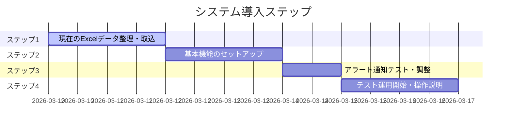

# 社員・資格管理システム 導入のご提案
## 株式会社信越報知 様 向け

---

## 1. はじめに

信越報知様が地域社会に提供されている「安心・安全」を、バックオフィス業務のDX（デジタルトランスフォーメーション）を通じて強力にバックアップいたします。

専門技術者の皆様が、資格管理や事務作業に追われることなく、**「現場の安全を守る」という本業に100%集中できる環境**を構築します。

---

## 2. 現状の課題と解決策

| 現状の課題 | 新システムによる解決 |
|---|---|
| **更新漏れのリスク**<br/>Excel管理では講習期限の把握が属人化し、見落としが怖い。 | **自動アラート機能**<br/>複雑な消防設備士の講習ルール（4/1起算）を自動計算し、メールで通知。 |
| **情報の散在**<br/>資格証書の写しや経歴が紙やフォルダにバラバラで、検索に時間がかかる。 | **一元管理データベース**<br/>社員名や資格種別で瞬時に検索。証書画像もスマホから即座に確認。 |
| **事務負担の増大**<br/>施工実績の集計や、名簿作成に多くの時間を費やしている。 | **ワンクリック出力**<br/>蓄積されたデータから、必要なフォーマットの書類を自動生成。 |

---

## 3. システムの3つの柱

### ① 業界特有の「確実なアラート」
消防設備士特有の「講習期限（初回2年/以後5年）」や「免状写真更新（10年）」を完全自動計算。
> [!IMPORTANT]
> **「うっかり失効」をゼロにします。**

### ② 現場・拠点をつなぐ「直感的な操作」
松本本社・塩尻・白馬の3拠点をクラウドで統合。
- **モバイル対応**: 外出先や現場から、自分の資格情報を確認・アップロード可能。
- **簡単入力**: 現場の負担にならない、最小限の入力インターフェース。

### ③ 最小限のコストで「高機能」
既存の大手パッケージシステム（カオナビ等）のような月額数十万円のコストをかけず、**中小企業に最適な規模感とコスト**で提供します。

---

## 4. 主要な画面イメージ

````carousel
### ダッシュボード
「今、何をすべきか」がひと目で分かります。
- 期限切れ・期限間近の警告
- 拠点ごとの資格保持状況
- 今月の予定（健康診断・車検）

<!-- slide -->
### 社員詳細・資格一覧
技術者一人ひとりの「スキルマップ」を可視化。
- 保有資格の画像プレビュー
- 過去の講習受講履歴
- 現場施工実績のログ

<!-- slide -->
### 自動通知メール
管理者と本人の双方に、適切なタイミングで通知。
- 60日、30日、14日前のリマインド
- 講習申込ステータスの管理
````

---

## 5. 導入スケジュール（案）



---

## 6. 将来的な発展性

本システムは拡張性の高い設計のため、段階的に機能を広げていくことが可能です。
- **点検スケジュール管理**: 物件ごとの法的点検日の管理
- **AI OCR**: 免状を写真で撮るだけで情報を自動読み取り
- **LINE連携**: チャット感覚での資格照会

---

信越報知様の「50年以上の信頼」を、最新のIT技術で次の50年へと繋げるパートナーとして尽力いたします。
